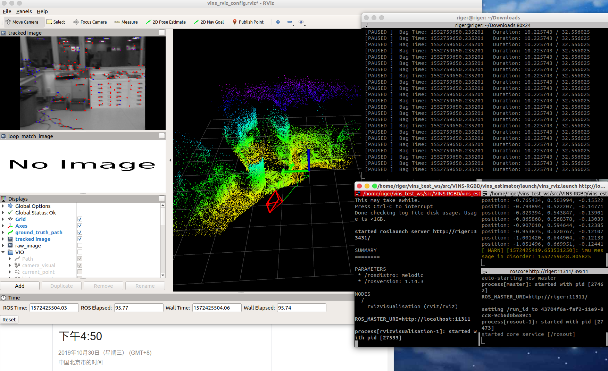
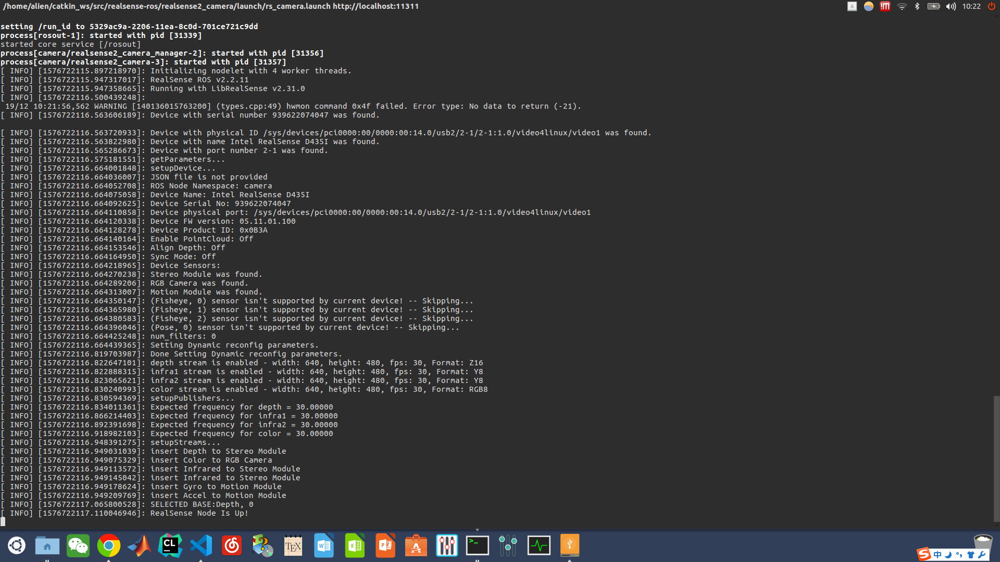

# TX2 安装环境后的测试

## mavros安装测试

安装完成mavros后，利用usb数据线连接pixhawk4飞控和tx2，在终端运行

`roslaunch mavros px4.launch`

启动mavros和px4的连接，接着运行

`rostopic echo /mavros/state`

查看mavros的运行状态，查看信息`connection`，如果显示为`True`则表示mavros和px4的连接正常测试通过；如果显示为`False`说明连接有问题，需重新拔插px4再次启动mavros。

## VINS-RGBD

VINS-RGBD的依赖可以按照其官方主页[VINS-RGBD](https://github.com/STAR-Center/VINS-RGBD)，所有需要的安装包在移动硬盘中存有备份。请确保按照顺序安装一下依赖

1. Eigen3
2. Sophus
3. Ceres
4. ros-kinetic-pcl-ros
5. VINS-RGBD

安装完成后利用数据集**Normal.bag**进行测试，在终端运行：

`roslaunch vins_estimator vins_rviz.launch`

`roslaunch vins_estimator realsense_color.launch`

切换至**Normal.bag**存放的目录，运行：

`rosbag play Normal.bag`

观察rviz的运行结果，在右侧有点云输出，则为成功。如下图所示。

如果右侧没有点云输出，则环境安装失败，按照经验主要是**Eigen3**的原因，需重新编译Eigen3后，全部重新编译。

## realsense-camera

将此目录下的`rs_camera.launch`替换`realsense_ros/realsense2_camera/launch`目录下的原有文件，终端运行：

`roslaunch realsense2_camera rs_camera.launch`

正确的运行结果如下：

常见的问题为会显示`uvc-data`的报错。如下图所示。需要重新安装`librealsense`，按照经验不推荐使用源码安装，使用`apt-get`的方式进行安装，参考[librealsense-linux-distribution](https://github.com/IntelRealSense/librealsense/blob/master/doc/distribution_linux.md)

以上测试完后，将此目录下的`realsense_color_config.yaml`替换`VINS-RGBD/config/realsense`目录下的原有文件，启动VINS-RGBD：

`roslaunch vins_estimator vins_rviz.launch`

`roslaunch vins_estimator realsense_color.launch`

刚开始需要缓慢移动相机完成初始化，之后可以正常使用视觉里程计。

